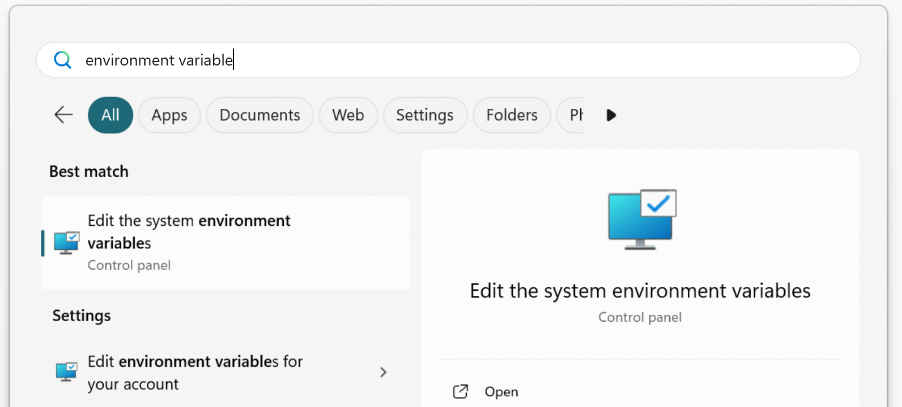
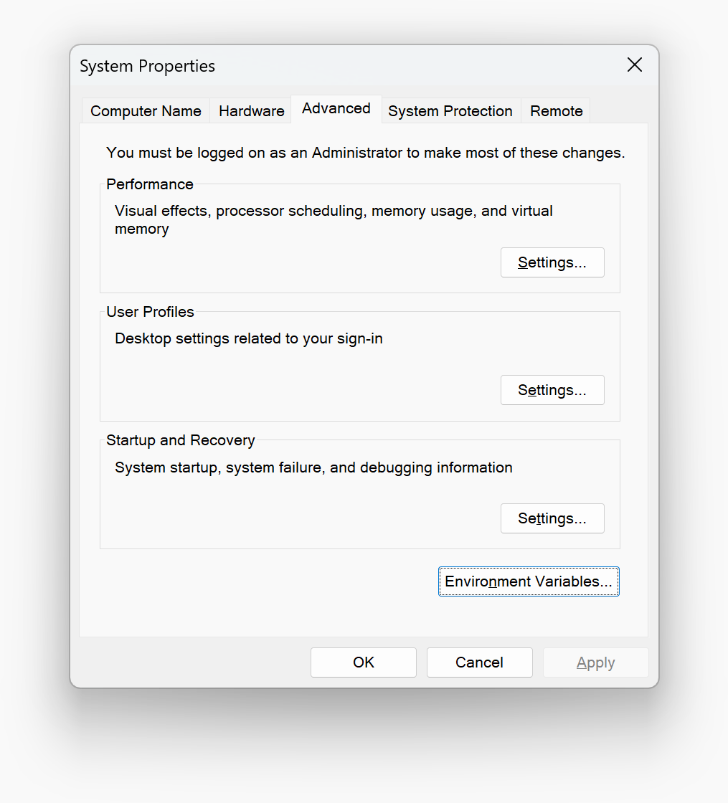
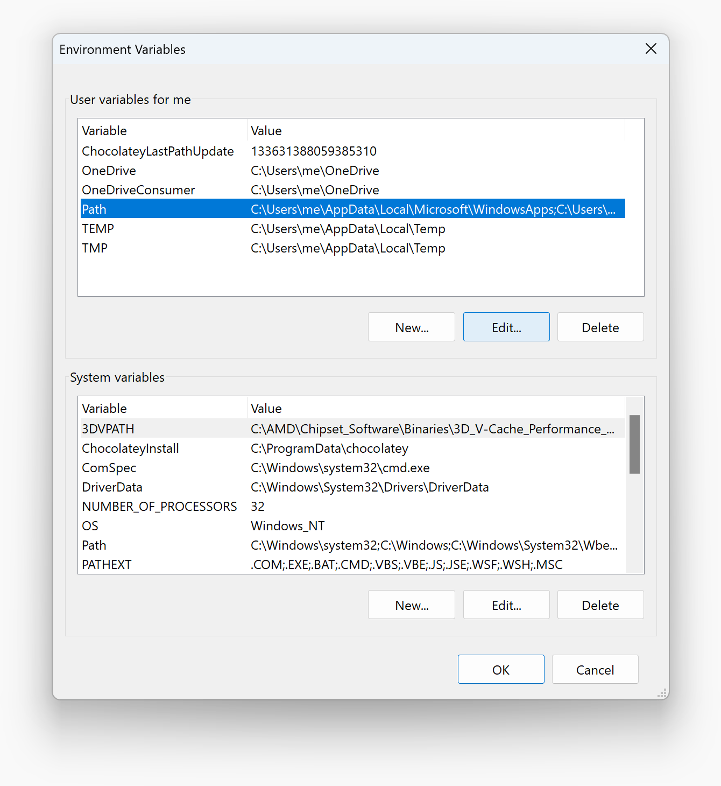
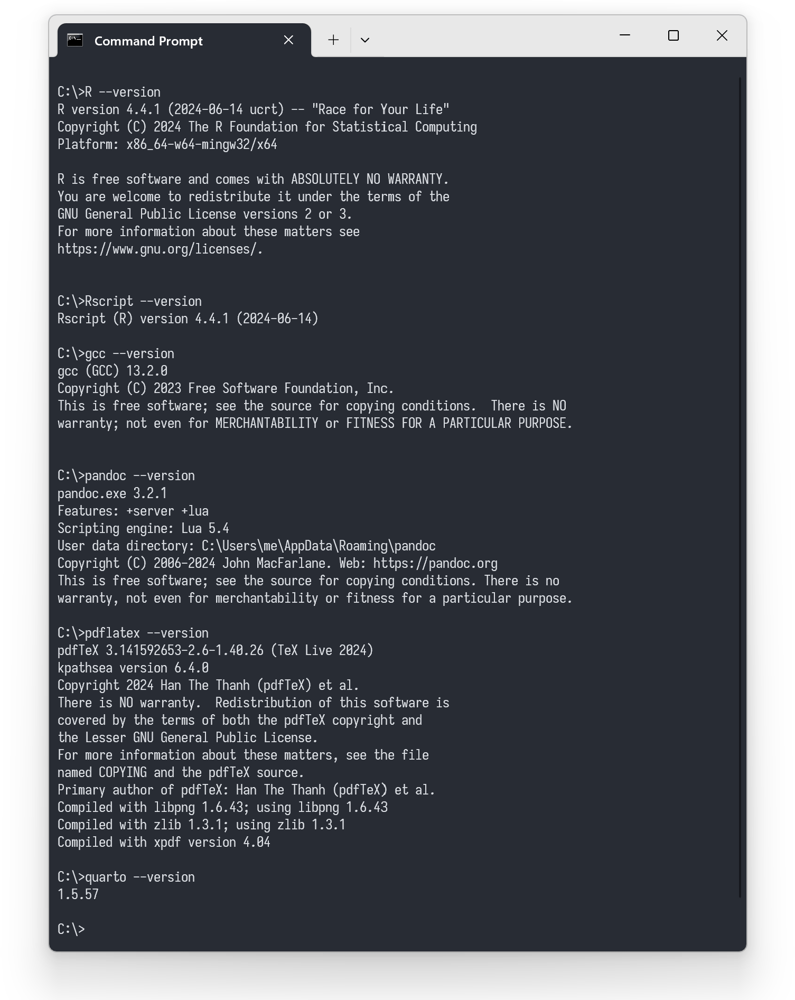

# Configure and verify the `PATH` environment variable in Windows

## Configure `PATH`

1. Click the start menu button, type `environment variable`, and select
   "Edit the system environment variables".



1. In the System Properties window, click the "Environment Variables..." button.



1. Under "User variables for me", find and select the `Path` variable,
   then click "Edit...".



1. Click "New" and add each relevant path on a new line.


1. Click "OK" to close each window.

## Verifying the `PATH` setup

1. Open a new Command Prompt window.

1. Run the following commands to test each added path.
   For example:

```batchfile
R --version
Rscript --version
gcc --version
pandoc --version
pdflatex --version
quarto --version
```

1. Verify that each command is recognized and returns version information:



If any command is not recognized, double check that the corresponding path
was added correctly to the `PATH` environment variable.
