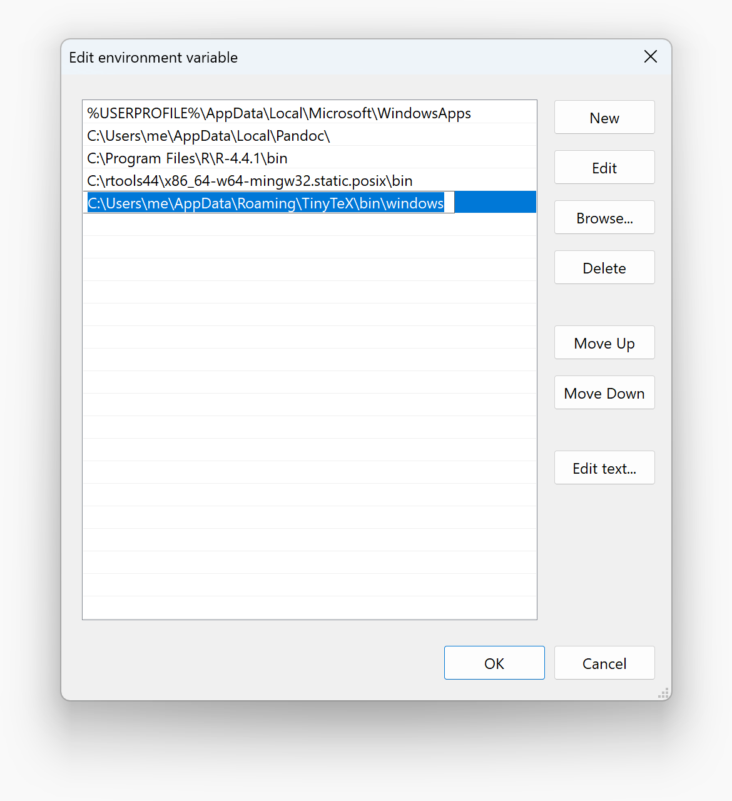

# Configure and verify the `PATH` environment variable in Windows

## Configure `PATH`

- Click the start menu button, type `environment variable`, and select
   "Edit the system environment variables".


- In the System Properties window, click the "Environment Variables..." button.


- Under "User variables for me", find and select the `Path` variable,
   then click "Edit...".


- Click "New" and add each relevant path on a new line.



- Click "OK" to close each window.

## Verifying the `PATH` setup

- Open a new Command Prompt window.

- Run commands to test each added path. For example:

  ```batchfile
  R --version
  Rscript --version
  gcc --version
  pandoc --version
  pdflatex --version
  quarto --version
  ```

- Verify that each command is recognized and returns version information:


  If any command is not recognized, double check that the corresponding path
  was added correctly to the `PATH` environment variable.
